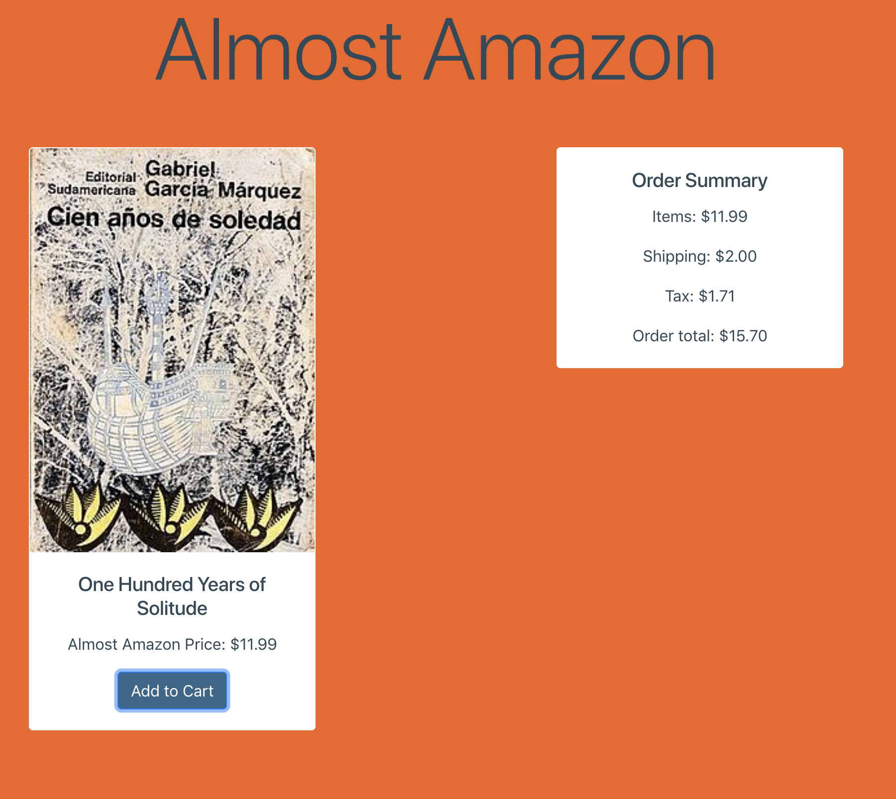

# Almost Amazon

This app is a faux-bookstore that sells only one book, which just happens to be the best book ever written. The app makes use of event listeners as well as ES6 modules, vanilla JavaScript, and Bootstrap. The purpose was to show how an actual e-seller can avoid nefarious users from tampering with costs of items.

## Screenshots


## How to run this project
* Use npm to install http-server in your terminal:
```sh
npm install -g http-server
```
* Run the server in your terminal
```sh
hs -p 9999
```
* Open chrome and navigate to:
```
localhost: 9999
```
